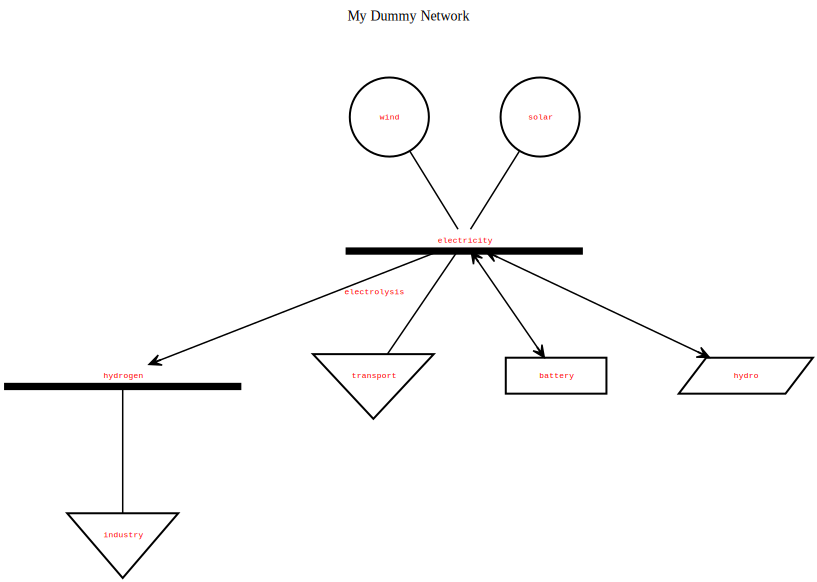

Description
-----------
PyPSATopo is a tool which allows generating the topographical representation of any arbitrary PyPSA-based network (thanks to the DOT language). To get a quick illustration of the capabilities of PyPSATopo, simply launch it in a terminal as follows:

    python pypsatopo.py

This will create a PyPSA-based network made of the following components:

```python
# create dummy (PyPSA) network
network = pypsa.Network(name = "My Dummy Network")

# add some dummy components to dummy (PyPSA) network
network.add("Bus", "oil")
network.add("Bus", "electricity")
network.add("Bus", "transport")
network.add("Generator", "oil", bus = "oil")
network.add("Generator", "solar", bus = "electricity")
network.add("Load", "vehicle", bus = "transport")
network.add("Store", "battery", bus = "electricity")
network.add("Link", "ICE", bus0 = "oil", bus1 = "transport")
network.add("Link", "BEV", bus0 = "electricity", bus1 = "transport")
```
... as well as generate the corresponding topographical representation in the [SVG](https://en.wikipedia.org/wiki/SVG) format (besides its counterpart in the DOT language):



In general, the following (generic) recipe should be followed to generate the topographical representation of a PyPSA-based network:

```python
# import PyPSATopo module
import pypsatopo

# create PyPSA-based network named 'my_network'
my_network = pypsa.Network()

# add components to network 'my_network'
# (...)

# generate topographical representation of network 'my_network' in the SVG format
pypsatopo.generate(my_network)
```

By default, PyPSATopo generates the topographical representation of a PyPSA-based network in SVG but other formats are also available (namely: [PNG](https://en.wikipedia.org/wiki/PNG), [JPG](https://en.wikipedia.org/wiki/JPEG), [GIF](https://en.wikipedia.org/wiki/GIF) and [PS](https://en.wikipedia.org/wiki/Postscript)), which can be specified through parameter `file_format`. Example:

```python
# generate topographical representation of network 'my_network' in the GIF format
pypsatopo.generate(my_network, file_format = "gif")
```

Also, by default, PyPSATopo generates the topographical representation of the entire network. This might be particularly overwhelming (visually speaking) depending on the complexity of the network - see [PyPSA-Eur-Sec network topographical representation](resources/pypsa-eur-sec_topography.svg) as an example. To mitigate this, parameters `focus` and `neighbourhood` (in function `generate`) may be utilized in combination to focus on a particular aspect/segment of the network. The former tells PyPSATopo which bus to start visiting, while the latter tells how much neighbourhood (around the bus) should be visited (in other words, how much (indirect) components attached to the bus should be included in the representation). For example, setting parameters `focus = "process emissions"` and `neighbourhood = 2` (which focuses/starts on the `process emissions` bus and includes all the components attached to it up to a maximum neighbourhood degree of `2`) yields this [result](resources/pypsa-eur-sec_process_emissions_topography.svg) upon generating PyPSA-Eur-Sec network topographical representation.

Additionally, in case fine-grained selection/visiting logic is needed, parameters `bus_filter` and `link_filter` (in function `generate`) may be utilized in combination or separately. Both parameters are expected to be (user-defined) [regular expressions](https://en.wikipedia.org/wiki/Regular_expression). While parameter `bus_filter` tells PyPSATopo which buses to include/exclude, parameter `link_filter` tells which links may be visited (or not) upon generating the topographical representation of a network.


Dependencies
------------
PyPSATopo leverages from several components to accomplish its functionality, namely: [Python](https://www.python.org), [PyPSA](https://pypsa.org), [Pandas](https://pandas.pydata.org) and [Dot](https://graphviz.org) (from Graphviz). Consequently, these should be installed before running PyPSATopo. As a reference, PyPSATopo is known to work correctly with the following versions of the components:

- Python 3.10.8

- PyPSA 0.21.3

- Pandas 1.5.3

- Dot 2.40.1


Support
-------
PyPSATopo is being actively developed and maintained by the Energy Systems Group at [Aarhus University](https://www.au.dk) (Denmark). Please open a ticket [here](https://github.com/ricnogfer/pypsatopo/issues) in case a bug was found or a feature is missing in this tool.

